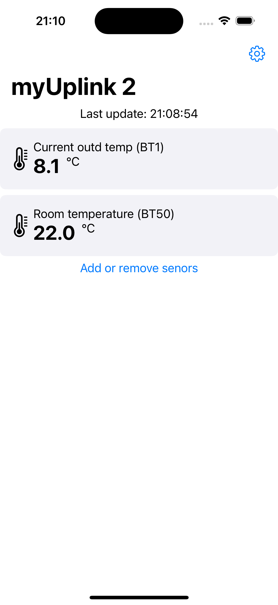
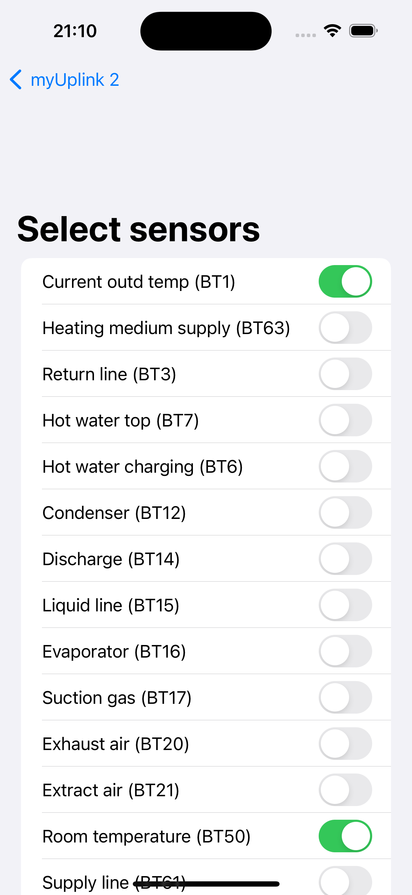

# iOS App For NIBE Boiler Using upLink API

App is in development and may contain many bugs and bad code 

## Get started

### Clone the project

Start of by cloning this repo to your Mac

### Set up secrets.plist

1. Create a new app on myUplink Dev Portal and save presented credentials
2. Open the app and go to settings using the cogwheel in the upper right corner
   
   
4. Enter credentials from myUplink and click save

   
6. Go back and select some sensors to display, it should now work!
   
   
